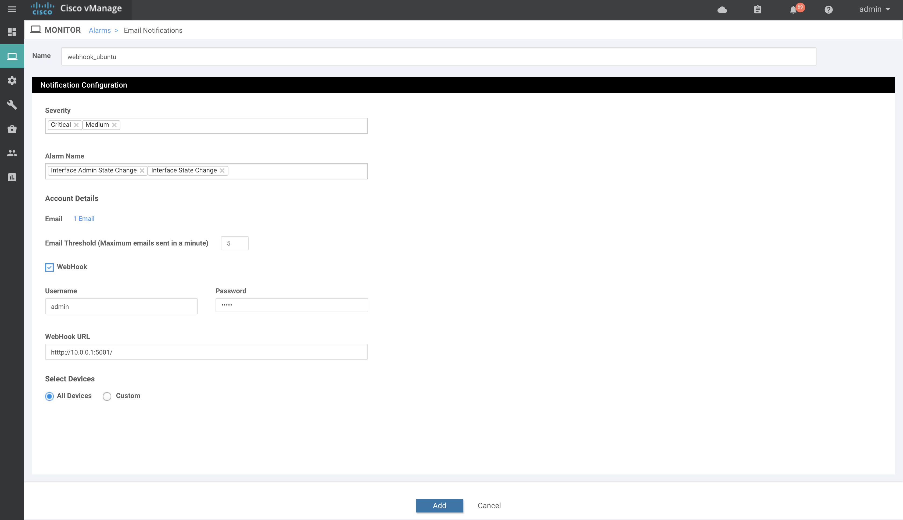
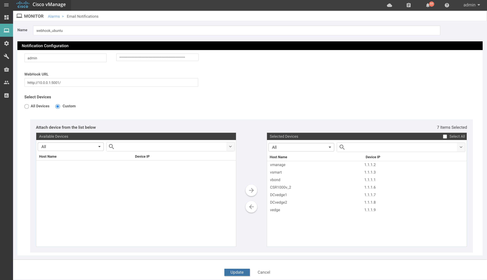
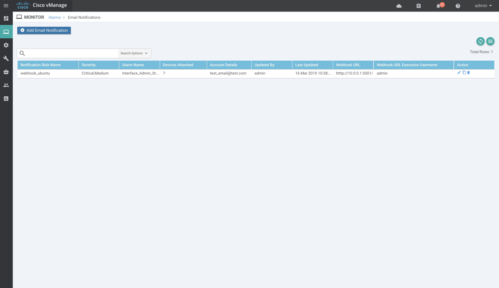

# Webhook 

-   Webhooks enable push-model mechanism to send notifications in real-time.
-   In order to retrieve alarms in real-time from the vManage using the REST API's, we need to poll for the data frequently. However by using webhooks, vManage can send HTTP POST request to the external systems in real-time once alarm is received. 
-   Webhooks are sometimes referred to as “Reverse APIs,” and we must design an API to consume or process the data sent via webhook.

# Prerequisites

-  This feature is supported from vManage 18.3 release onwards

# Configure

Steps to enable webhook notifications for pushing alarms to external systems.

-    Select "Email Notifications" from "Monitor -> Alarms" 
-    Enable webhook checkbox. 
-    Select severity level and Alarms for which webhook notifications should be triggered.
-    Provide the webhook server URL, username and password for webhook. ( Note : If webhook server doesn't have authentication configured, please provide dummy username and password )
-    Webhook URL can be http:// or https://
-    Enable Email notifications option in Administration settings of vManage 

Note: provide the dummy email address as place holder for Email notifications and then click Add.

Below is an example screenshot, Here we are enabling webhook notifications for Critical and Medium alarms related to *"interface-admin-state-change"* and *"interface-state-change"*



Notifications can be enabled for all devices or custom list of devices. 



#	Notifications Dashboard 



# Test Webhook

From vManage shell, run curl command and send dummy HTTP POST request to webhook server to make sure it is reachable.

Sample output (using webhook.site as server)

```
vmanage:~$ curl -v -X POST -H 'Content-type: application/json' https://webhook.site/cb208ecc-4520-4bcd-b4b3-28f58d7b129d
*   Trying 188.226.137.35...
* TCP_NODELAY set
* Connected to webhook.site (188.226.137.35) port 443 (#0)
* found 157 certificates in /etc/ssl/certs/ca-certificates.crt
* ALPN, offering http/1.1
* SSL connection using TLS1.2 / ECDHE_RSA_AES_256_GCM_SHA384
* 	 server certificate verification OK
* 	 server certificate status verification SKIPPED
* 	 common name: webhook.site (matched)
* 	 server certificate expiration date OK
* 	 server certificate activation date OK
* 	 certificate public key: RSA
* 	 certificate version: #3
* 	 subject: CN=webhook.site
* 	 start date: Mon, 17 Dec 2018 11:32:42 GMT
* 	 expire date: Sun, 17 Mar 2019 11:32:42 GMT
* 	 issuer: C=US,O=Let's Encrypt,CN=Let's Encrypt Authority X3
* 	 compression: NULL
* ALPN, server did not agree to a protocol
> POST /cb208ecc-4520-4bcd-b4b3-28f58d7b129d HTTP/1.1
> Host: webhook.site
> User-Agent: curl/7.58.0
> Accept: */*
> Content-type: application/json
>
< HTTP/1.1 200 OK
< Server: nginx/1.10.3
< Content-Type: text/plain; charset=UTF-8
< Transfer-Encoding: chunked
< Vary: Accept-Encoding
< X-Request-Id: fbcad435-4164-440b-a4de-0d82efa2fb41
< X-Token-Id: cb208ecc-4520-4bcd-b4b3-28f58d7b129d
< Cache-Control: no-cache, private
< Date: Sat, 16 Mar 2019 12:33:05 GMT
< X-RateLimit-Limit: 30
< X-RateLimit-Remaining: 29
<
* Connection #0 to host webhook.site left intact
vmanage:~$
```

# Set up Webhook server on ubuntu

Now let’s try to set up webhook server on ubuntu to accept notifications sent from vManage

- In order to accept HTTP post requests sent from vManage, we need to enable http web server and design API route.
- Below code spins up flask web server listening on port 5001 for HTTP POST request
- Defined alarms() functions accepts the POST request at route http://<server-ip>:<port>/ and extracts the data from request.

```
from flask import Flask, request
import json

app = Flask(__name__)

@app.route('/',methods=['POST'])
def alarms():
   data = json.loads(request.data)
   print(data)
   return "OK"

if __name__ == '__main__':
   app.run(host='0.0.0.0', port=5001, debug=True)
```

# Logs from Webhook Server:

Spin up http webhook server as background process

```
$python3 webhook.py &
[1] 7889

 * Serving Flask app "webhook" (lazy loading)
 * Environment: production
   WARNING: Do not use the development server in a production environment.
   Use a production WSGI server instead.
 * Debug mode: on
 * Running on http://0.0.0.0:5001/ (Press CTRL+C to quit)
 * Restarting with stat
 * Debugger is active!
 * Debugger PIN: 216-076-679
```

Sample output on webhook server on receiving notifications from the vManage.

```
 {'devices': [{'system-ip': '1.1.1.2'}], 'eventname': 'interface-admin-state-change', 'type': 'interface-admin-state-change', 'rulename': 'interface-admin-state-change', 'component': 'VPN', 'entry_time': 1552699205000, 'statcycletime': 1552699205000, 'message': 'The interface admin-state changed to down', 'severity': 'Critical', 'severity_number': 1, 'uuid': '735d1df8-acba-47d6-94c1-a76fe6f7b12e', 'values': [{'host-name': 'vmanage', 'system-ip': '1.1.1.2', 'if-name': 'eth0', 'new-admin-state': 'down', 'vpn-id': '0'}], 'rule_name_display': 'Interface_Admin_State_Change', 'receive_time': 1552699205615, 'values_short_display': [{'host-name': 'vmanage', 'system-ip': '1.1.1.2', 'if-name': 'eth0', 'new-admin-state': 'down'}], 'acknowledged': False, 'active': True}
<vmanage-ip> - - [16/Mar/2019 01:22:14] "POST / HTTP/1.1" 200 -
{'devices': [{'system-ip': '1.1.1.2'}], 'eventname': 'interface-state-change', 'type': 'interface-state-change', 'rulename': 'interface-state-change', 'component': 'VPN', 'entry_time': 1552699205000, 'statcycletime': 1552699205000, 'message': 'The interface oper-state changed to down', 'severity': 'Critical', 'severity_number': 1, 'uuid': 'caffbef4-3ab2-49bc-b9e9-1d8e79753d2b', 'values': [{'host-name': 'vmanage', 'system-ip': '1.1.1.2', 'if-name': 'eth0', 'new-state': 'down', 'vpn-id': '0'}], 'rule_name_display': 'Interface_State_Change', 'receive_time': 1552699205815, 'values_short_display': [{'host-name': 'vmanage', 'system-ip': '1.1.1.2', 'if-name': 'eth0', 'new-state': 'down'}], 'acknowledged': False, 'active': True}
<vmanage-ip> - - [16/Mar/2019 01:22:14] "POST / HTTP/1.1" 200 -
{'devices': [{'system-ip': '1.1.1.2'}], 'eventname': 'interface-admin-state-change', 'type': 'interface-admin-state-change', 'rulename': 'interface-admin-state-change', 'component': 'VPN', 'entry_time': 1552699209000, 'statcycletime': 1552699209000, 'message': 'The interface admin-state changed to up', 'severity': 'Medium', 'severity_number': 3, 'uuid': 'b1785534-8132-4039-8472-d64e04d4e558', 'values': [{'host-name': 'vmanage', 'system-ip': '1.1.1.2', 'if-name': 'eth0', 'new-admin-state': 'up', 'vpn-id': '0'}], 'rule_name_display': 'Interface_Admin_State_Change', 'receive_time': 1552699209618, 'values_short_display': [{'host-name': 'vmanage', 'system-ip': '1.1.1.2', 'if-name': 'eth0', 'new-admin-state': 'up'}], 'acknowledged': False, 'cleared_events': ['735d1df8-acba-47d6-94c1-a76fe6f7b12e'], 'active': False}
<vmanage-ip> - - [16/Mar/2019 01:22:18] "POST / HTTP/1.1" 200 -
{'devices': [{'system-ip': '1.1.1.2'}], 'eventname': 'interface-state-change', 'type': 'interface-state-change', 'rulename': 'interface-state-change', 'component': 'VPN', 'entry_time': 1552699209000, 'statcycletime': 1552699209000, 'message': 'The interface oper-state changed to up', 'severity': 'Medium', 'severity_number': 3, 'uuid': '2ca8864f-8a94-4620-9b7a-716fa506e860', 'values': [{'host-name': 'vmanage', 'system-ip': '1.1.1.2', 'if-name': 'eth0', 'new-state': 'up', 'vpn-id': '0'}], 'rule_name_display': 'Interface_State_Change', 'receive_time': 1552699209818, 'values_short_display': [{'host-name': 'vmanage', 'system-ip': '1.1.1.2', 'if-name': 'eth0', 'new-state': 'up'}], 'acknowledged': False, 'cleared_events': ['caffbef4-3ab2-49bc-b9e9-1d8e79753d2b'], 'active': False}
<vmanage-ip> - - [16/Mar/2019 01:22:18] "POST / HTTP/1.1" 200 -
```

# Alarms on vManage

-	Above webhook logs corresponds to these alarms which were recieved by vManage.


# References

online webhooks can be set up using https://webhook.site

sdwan docs : https://sdwan-docs.cisco.com/Product_Documentation/vManage_How-Tos/Operation/Configure_Email_Notifications_for_Alarms
